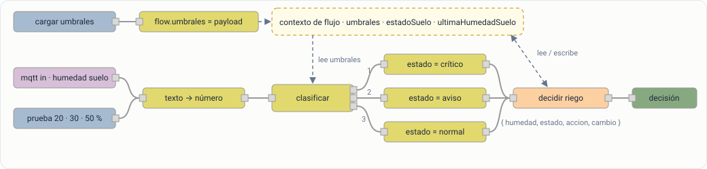
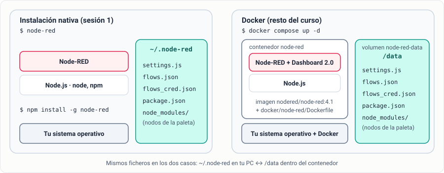
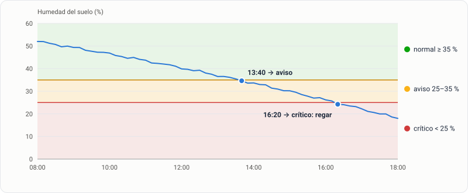

# Sesión 1 · Fundamentos de Node-RED y flujos de control

## Objetivos de la sesión

- Instalar Node-RED de forma nativa con npm, identificar los ficheros de su directorio de usuario y levantar después el entorno del curso con Docker.
- Explicar la programación basada en flujos y la estructura del objeto `msg`.
- Construir flujos con los nodos `inject`, `debug`, `change`, `switch` y `function`.
- Recibir por MQTT una magnitud del invernadero (real o simulada) y convertirla a un valor numérico.
- Programar una decisión de control basada en umbrales guardados en el contexto de flujo.

## Conexión con el sistema del invernadero

Esta sesión construye la **lógica de procesado**: la pieza que recibe una lectura, la interpreta y decide qué hacer. En las sesiones siguientes esa decisión se enriquecerá con la previsión meteorológica (S2), actuará sobre la bomba real (S3), se verá en el panel (S4), quedará registrada (S5) y generará alertas (S6).



Este es el flujo que construirás en la práctica guiada. Los recuadros discontinuos son el **contexto de flujo**: los umbrales y el último estado se guardan ahí, no en los nodos.

## Conceptos clave

### Programación basada en flujos

En Node-RED un programa es un **flujo**: un grafo de **nodos** unidos por **cables**. Cada nodo recibe un mensaje, hace una cosa y pasa uno o más mensajes al siguiente. No hay un bucle principal: el motor (Node.js) ejecuta cada nodo cuando le llega un mensaje.

Ya conoces la idea desde Python:

| Script Python con `paho-mqtt` | Flujo de Node-RED |
|-------------------------------|-------------------|
| `client.connect(...)` y `loop_forever()` | Nodo de configuración `mqtt-broker`: Node-RED mantiene la conexión |
| `client.subscribe("invernadero/suelo/humedad")` | Nodo `mqtt in` con ese topic |
| Callback `on_message(client, userdata, msg)` | Todo lo que cuelga del cable de salida del `mqtt in` |
| `if valor < umbral: ...` | Nodo `switch` |
| `print(...)` | Nodo `debug` |

La diferencia está en lo que viene después: en Node-RED añadir un panel, una base de datos o un bot de Telegram es añadir nodos al mismo flujo, no reescribir el script.

### El mensaje `msg`

Todo lo que circula por un cable es un objeto JavaScript llamado `msg`:

| Propiedad | Contenido |
|-----------|-----------|
| `msg.payload` | El dato principal. Con MQTT, el contenido del mensaje: `"42.5"` |
| `msg.topic` | El topic MQTT o una etiqueta libre: `"invernadero/suelo/humedad"` |
| `msg._msgid` | Identificador único que asigna Node-RED |
| *cualquier otra* | Puedes añadir las tuyas: `msg.estado`, `msg.unidad`… |

Documentación: [Working with messages](https://nodered.org/docs/user-guide/messages).

### Nodos de esta sesión

| Nodo | Para qué |
|------|----------|
| `inject` | Genera un mensaje: al pulsar, al desplegar o periódicamente |
| `debug` | Muestra el mensaje en la barra lateral de depuración |
| `change` | Modifica propiedades sin escribir código: asignar, borrar, mover, expresiones JSONata |
| `switch` | Enruta el mensaje a una salida u otra según reglas |
| `function` | Código JavaScript con acceso a `msg`, al contexto y al estado del nodo |
| `mqtt in` | Suscripción a un topic MQTT |

Documentación: [Core nodes](https://nodered.org/docs/user-guide/nodes) y [Writing functions](https://nodered.org/docs/user-guide/writing-functions).

### Contexto

Los mensajes no se acuerdan de nada. Para guardar estado entre mensajes (el último valor, unos umbrales, un contador) Node-RED ofrece el **contexto** en tres ámbitos: **nodo** (`context`), **flujo** (`flow`, compartido por los nodos de la pestaña) y **global** (`global`, todo Node-RED). Documentación: [Working with context](https://nodered.org/docs/user-guide/context).

## Práctica guiada paso a paso

### Paso 1 · Instalar Node-RED en tu PC (40 min)

Antes de usar el entorno del curso vas a instalar Node-RED a mano. Así verás qué es realmente, una aplicación de Node.js, y dónde guarda tu trabajo.

1. **Instala Node.js** en su versión LTS. Node-RED 4 necesita Node.js 18 o superior.

   ::: code-group

   ```powershell [Windows]
   winget install OpenJS.NodeJS.LTS
   # o descarga el instalador LTS de https://nodejs.org
   ```

   ```bash [macOS]
   brew install node
   ```

   ```bash [Linux (Debian/Ubuntu)]
   curl -fsSL https://deb.nodesource.com/setup_lts.x | sudo -E bash -
   sudo apt-get install -y nodejs
   ```

   :::

   Abre una terminal **nueva** y comprueba las versiones con `node -v` y `npm -v`.

2. **Instala Node-RED** como paquete global de npm:

   ::: code-group

   ```powershell [Windows]
   npm install -g --unsafe-perm node-red
   ```

   ```bash [macOS / Linux]
   sudo npm install -g --unsafe-perm node-red
   ```

   :::

3. **Arráncalo** con `node-red` y lee las primeras líneas del log. Localiza las versiones de Node-RED y de Node.js, el **User directory**, el **Settings file**, el **Flows file** y la línea `Server now running at http://127.0.0.1:1880/`.

4. **Primer flujo.** Abre [http://localhost:1880](http://localhost:1880), arrastra un `inject` y un `debug` al lienzo, únelos y pulsa **Deploy** (arriba a la derecha). Pulsa el botón del `inject` y abre la pestaña de depuración (icono del insecto): aparece un *timestamp*. Nada se ejecuta hasta que despliegas; cada cambio en el editor requiere un nuevo **Deploy**.

5. **Instala un nodo de la paleta.** En **Menú → Manage palette → Install**, busca `node-red-node-random` e instálalo. Aparece el nodo `random` en la paleta: pruébalo con `inject` → `random` → `debug`.

6. **Explora el directorio de usuario** desde otra terminal, sin parar Node-RED:

   ::: code-group

   ```powershell [Windows]
   dir $HOME\.node-red
   type $HOME\.node-red\package.json
   ```

   ```bash [macOS / Linux]
   ls -la ~/.node-red
   cat ~/.node-red/package.json
   ```

   :::

   `package.json` lista `node-red-node-random`: lo que instalas desde la paleta se guarda en tu directorio de usuario, no junto a Node-RED. En el apartado [Node-RED como plataforma](#node-red-como-plataforma) tienes qué es cada fichero.

7. **Comprueba que el trabajo persiste.** Para Node-RED con **Ctrl+C** y vuelve a arrancarlo: el flujo sigue ahí. Abre `flows.json` con un editor de texto: es el mismo JSON que obtienes al exportar un flujo.

8. **Para Node-RED** (**Ctrl+C**) antes de seguir. Si quieres conservar el flujo, expórtalo antes con **Ctrl+E**.

::: warning Puerto 1880 ocupado
El Node-RED nativo y el de Docker usan el mismo puerto. Si en el paso 2 `docker compose up` falla con *port is already allocated*, o el editor que abres no es el que esperas, es que el nativo sigue en marcha.
:::

::: tip Sin permisos de administrador
Si no puedes instalar paquetes globales, ejecuta Node-RED sin instalarlo con `npx node-red`.
:::

### Paso 2 · Pasar al entorno del curso con Docker (20 min)

Una instalación nativa sirve para un Node-RED. El sistema del invernadero necesita además un broker, una base de datos y el simulador, con las mismas versiones en todos los PCs. Docker Compose levanta todo eso igual en cada máquina con un solo comando.



1. Descarga la carpeta `docker/` del repositorio del curso y abre una terminal en ella.
2. Crea tu fichero de configuración:

   ```bash
   cp .env.example .env
   ```

3. Edita `.env` y deja activo el bloque que corresponda:

   ::: code-group

   ```ini [.env · laboratorio]
   # Broker central de la Raspberry Pi
   COMPOSE_PROFILES=
   MQTT_HOST=192.168.0.10
   ```

   ```ini [.env · casa (simulador)]
   # Broker local + simulador del invernadero
   COMPOSE_PROFILES=casa
   MQTT_HOST=mosquitto
   ```

   :::

4. Arranca el entorno (la primera vez tarda unos minutos en construir las imágenes):

   ```bash
   docker compose up -d --build
   docker compose ps
   ```

5. Abre el editor en [http://localhost:1880](http://localhost:1880). Está vacío: es otra instalación, con su propio directorio de usuario. Compruébalo:

   ```bash
   docker compose exec node-red ls -la /data
   ```

   Si exportaste el flujo del paso 1, impórtalo aquí con **Ctrl+I**.

::: warning En el laboratorio
Tu PC tiene que estar conectado a la **Wi-Fi del router del invernadero**, no a la red de la universidad. Si no, Node-RED no alcanza la Raspberry Pi.
:::

::: tip En casa
El simulador publica los mismos topics que el invernadero real. `SIM_VELOCIDAD=60` hace que un minuto real equivalga a una hora simulada: verás secarse el suelo en pocos minutos. Mira qué publica con `docker compose logs -f simulador`.
:::

### Paso 3 · Anatomía de `msg` (15 min)

1. Ya en el Node-RED de Docker, crea un `inject` → `debug` (o usa el que importaste). En el `inject`, cambia `msg.payload` a tipo *string* con valor `42.5` y `msg.topic` a `invernadero/suelo/humedad`.
2. En el `debug`, cambia *Output* a **complete msg object**. Despliega y pulsa: verás `payload`, `topic` y `_msgid`.
3. Inserta un `change` entre ambos con la regla *Set* `msg.unidad` = `%`. Comprueba que el mensaje llega con la nueva propiedad.

### Paso 4 · Conectar con el invernadero: `mqtt in` (30 min)

1. Arrastra un `mqtt in`. En **Server**, pulsa el lápiz para crear el nodo de configuración del broker:

   | Campo | Valor |
   |-------|-------|
   | Name | `Broker invernadero` |
   | Server | `${MQTT_HOST}` |
   | Port | `${MQTT_PORT}` |
   | Client ID | vacío (Node-RED genera uno aleatorio) |
   | Security → Username | `alumno` |
   | Security → Password | la contraseña del laboratorio |

   `${MQTT_HOST}` se sustituye por la variable de entorno del contenedor. Así el mismo flujo funciona en el laboratorio y en casa: solo cambia el `.env`.

2. En el `mqtt in`: **Topic** `invernadero/suelo/humedad`, **QoS** 0, **Output** *a UTF-8 string*.
3. Conéctalo a un `debug`, despliega y comprueba que bajo el nodo aparece **connected** y que llegan lecturas cada pocos segundos.

Topics disponibles (todos con payload numérico en texto):

| Topic | Magnitud |
|-------|----------|
| `invernadero/suelo/humedad` | Humedad del suelo (%) |
| `invernadero/dht22/temperatura` · `invernadero/dht11/temperatura` | Temperatura ambiente (ºC) |
| `invernadero/dht22/humedad` · `invernadero/dht11/humedad` | Humedad ambiente (%) |
| `invernadero/ultrasonidos/distancia` | Distancia al agua del depósito (cm) |
| `invernadero/balanza/peso` | Peso (g) |
| `invernadero/tds/tds` | Sólidos disueltos en el agua (ppm) |

::: warning `disconnected` bajo el `mqtt in`
- En el laboratorio: comprueba la Wi-Fi y el usuario y la contraseña de la pestaña *Security*.
- En casa: comprueba que `MQTT_ALUMNO_PASS` del `.env` coincide con la contraseña que has puesto en Node-RED, y que el perfil `casa` está activo (`docker compose ps` debe mostrar `mosquitto` y `simulador`).
:::

::: info Los topics llevan *retain*
Al suscribirte recibes enseguida el último valor, aunque el sensor no haya publicado todavía.
:::

### Paso 5 · De texto a número con `change` (15 min)

Los ESP32 publican **texto**: `"42.5"`, no `42.5`. Compararlo con un umbral numérico sin convertirlo es una fuente clásica de errores.

1. Añade un `change` después del `mqtt in` con nombre `texto → número`.
2. Regla: *Set* `msg.payload` a la expresión (tipo **J:** JSONata) `$number(payload)`.
3. Con el `debug` comprueba que el valor aparece ahora en azul (número) y no entre comillas (texto).

### Paso 6 · Probar sin sensores (10 min)

Para probar la lógica con valores concretos, sin depender de lo que marque el sensor en ese momento, añade tres `inject` con payload *string* `20.0`, `30.0` y `50.0` y conéctalos a la entrada del `change`. Son tus **casos de prueba**: los usarás en los pasos siguientes y en el entregable.

### Paso 7 · Umbrales en el contexto de flujo (20 min)

Los umbrales no deben estar escritos a fuego dentro de los nodos: se cargan una vez en el contexto de flujo y todos los nodos los leen de ahí.

1. Añade un `inject` llamado `cargar umbrales`, con **Inject once after 0.1 seconds** activado y payload JSON:

   ```json
   { "suelo": { "critico": 25, "aviso": 35 } }
   ```

2. Conéctalo a un `change` con la regla *Set* `flow.umbrales` = `msg.payload`.
3. Despliega y abre la pestaña **Context Data** de la barra lateral. Pulsa refrescar en *Flow* y comprueba que `umbrales` está guardado.

### Paso 8 · Clasificar con `switch` (20 min)

Los dos umbrales dividen el rango de humedad en tres bandas. Así se clasificaría un día sin riego:



1. Añade un `switch` llamado `clasificar` sobre `msg.payload` con tres reglas:

   | Regla | Valor | Salida |
   |-------|-------|--------|
   | `<` | `flow.umbrales.suelo.critico` | 1 |
   | `<` | `flow.umbrales.suelo.aviso` | 2 |
   | *otherwise* | | 3 |

   Elige el tipo **flow.** en el desplegable del valor. Abajo, selecciona **stopping after first match**: sin esa opción, un 20 % cumpliría las dos primeras reglas y saldría por ambas.

2. En cada salida, un `change` que asigne `msg.estado` = `crítico`, `aviso` o `normal`.
3. Prueba con los tres `inject` y comprueba que cada valor sale por la salida esperada.

### Paso 9 · Decidir con `function` (25 min)

Une las tres salidas en un `function` llamado `decidir riego`:

```js
// Guarda el último estado en el contexto de flujo y decide la acción
const anterior = flow.get("estadoSuelo");
flow.set("estadoSuelo", msg.estado);
flow.set("ultimaHumedadSuelo", msg.payload);

const accion = msg.estado === "crítico" ? "regar" : "no regar";

msg.payload = {
    humedad: msg.payload,
    estado: msg.estado,
    accion: accion,
    cambio: msg.estado !== anterior   // true solo cuando cambia el estado
};

node.status({
    fill: msg.estado === "normal" ? "green" : msg.estado === "aviso" ? "yellow" : "red",
    shape: "dot",
    text: `${msg.payload.humedad} % → ${accion}`
});
return msg;
```

- `flow.get`/`flow.set` leen y escriben el contexto de flujo.
- `node.status` muestra un indicador bajo el nodo: útil para ver el estado sin abrir la depuración.
- `cambio` servirá en la sesión 6 para avisar solo cuando el estado cambia, no con cada lectura.

Conecta la salida a un `debug` y prueba con los `inject` y con los datos reales.

Si te atascas, puedes descargar el flujo de referencia de la práctica guiada: [s1-control-riego.json](../flows/s1-control-riego.json){download}. Impórtalo con **Menú → Import**, abre el nodo `Broker invernadero` y escribe el usuario y la contraseña: las credenciales nunca se exportan.

## Node-RED como plataforma

### Dentro de una instalación de Node-RED

Todo lo que distingue a tu Node-RED de otro está en su **directorio de usuario**: `~/.node-red` en la instalación nativa y `/data` en el contenedor.

| Fichero | Contenido |
|---------|-----------|
| `settings.js` | Configuración del runtime: puerto, seguridad del editor, almacenamiento del contexto… |
| `flows.json` | Tus flujos: lo que guardas al pulsar **Deploy** |
| `flows_cred.json` | Las credenciales de los nodos (contraseñas, tokens), cifradas y separadas de los flujos |
| `package.json` y `node_modules/` | Los nodos instalados desde la paleta |
| `.config.*.json` | Estado interno del editor; no lo toques |

Hacer copia de seguridad de un Node-RED es copiar ese directorio. En la sesión 6 editarás `settings.js` para proteger el editor y cifrar las credenciales.

### Contexto: dónde vive el estado

- La pestaña **Context Data** muestra el contexto de nodo, flujo y global. Úsala para depurar.
- Por defecto el contexto está **en memoria**: se pierde al reiniciar Node-RED. Por eso los umbrales se cargan con un `inject` *once*.
- Usa `flow` para lo que comparten los nodos de una pestaña y `global` solo para lo que necesiten varias pestañas.

### Organizar el flujo

- **Nombres**: cada nodo con un nombre que diga qué hace (`texto → número`, no `change`).
- **Comentarios**: nodos `comment` como títulos de sección. Su pestaña *info* admite Markdown.

### Importar y exportar

- **Ctrl+E** exporta la selección, la pestaña o todos los flujos a JSON. **Ctrl+I** importa.
- El JSON incluye los nodos de configuración (el broker) pero **no las credenciales**: por eso puedes compartir flujos sin filtrar contraseñas.
- Exportar es la forma de entregar tu trabajo y de guardar copias: hazlo al final de cada sesión.

## Entregable y evidencias para el informe

### Qué debe funcionar

Amplía el flujo de la práctica guiada para que controle también la **temperatura**:

1. Suscríbete además a `invernadero/dht22/temperatura` y conviértela a número.
2. Añade al `inject` de umbrales los de temperatura, por ejemplo:

   ```json
   {
     "suelo":       { "critico": 25, "aviso": 35 },
     "temperatura": { "aviso": 30, "critico": 35 }
   }
   ```

3. Clasifica cada temperatura como `normal`, `aviso` o `crítico`. Cuidado: aquí el peligro está en los valores **altos**.
4. Una única función de decisión que, con la **última lectura de cada sensor** guardada en el contexto, produzca:

   ```json
   { "regar": true, "ventilar": false, "suelo": "crítico", "temperatura": "normal" }
   ```

   Criterio mínimo: regar si el suelo está en estado crítico y ventilar si la temperatura está en aviso o crítico.

5. Casos de prueba con `inject` que cubran los tres estados de cada magnitud.

### Cómo se comprueba

- Con los `inject` de prueba, cada combinación produce la decisión esperada.
- Con datos reales o simulados, la decisión se actualiza al llegar cada lectura.
- Cambiar un umbral en el `inject` y volver a pulsarlo cambia el comportamiento sin tocar ningún otro nodo.

**Criterios de calidad:** umbrales solo en el contexto (ningún número "mágico" dentro de `switch` o `function`), nodos con nombre y flujo organizado con comentarios.

### Evidencias que debes guardar

- [ ] Captura de la terminal con Node-RED nativo arrancado (versiones y *User directory*) y del listado de tu `~/.node-red`.
- [ ] Captura del flujo completo.
- [ ] Captura de la depuración con al menos un caso de cada estado para cada magnitud.
- [ ] Captura de **Context Data** con los umbrales y los últimos valores guardados.
- [ ] Flujo exportado: `s1-<tu-apellido>.json`.
- [ ] En el informe, respuesta breve a:
  - ¿Dónde se guardan tus flujos en la instalación nativa y en Docker? ¿Qué ganas usando Docker?
  - ¿Qué ventajas e inconvenientes ves frente a tu script Python de la práctica anterior?
  - ¿Por qué hay que convertir el payload a número y qué pasaría si no lo hicieras?
  - ¿Por qué el `switch` debe detenerse en la primera coincidencia?

## Recursos adicionales

- [Node-RED — Running Node-RED locally](https://nodered.org/docs/getting-started/local)
- [Node-RED — Getting started with Docker](https://nodered.org/docs/getting-started/docker)
- [Node-RED — Using environment variables](https://nodered.org/docs/user-guide/environment-variables)
- [Node-RED Cookbook](https://cookbook.nodered.org/)
- [JSONata — Documentación](https://docs.jsonata.org/overview)
