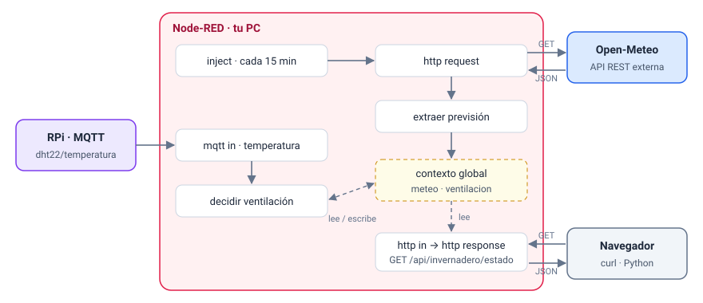

# Sesión 2 · Integración con APIs externas

## Objetivos de la sesión

- Consumir una API REST con `http request` y procesar su respuesta JSON.
- Combinar un dato externo (temperatura exterior) con uno del invernadero (temperatura interior) en una decisión de control.
- Distinguir y tratar los dos tipos de fallo de una llamada: la respuesta con código de error y la ausencia de respuesta.
- Exponer el estado del invernadero como API propia con `http in` y `http response`.
- Leer configuración desde variables de entorno.

## Conexión con el sistema del invernadero

Hasta ahora el sistema solo sabía lo que miden sus sensores. En esta sesión aprende lo que pasa **fuera**: consulta periódicamente la previsión meteorológica y la guarda para que cualquier flujo la use. Además, el sistema se abre hacia fuera: ofrece un endpoint que cualquier programa (tu script Python, un navegador, más adelante el agente de IA de la sesión 7) puede consultar.



Node-RED hace aquí **dos papeles**: arriba es **cliente** de una API ajena (`http request`) y abajo es **servidor** de una API propia (`http in` → `http response`).

## Conceptos clave

### Anatomía de una llamada REST

| Elemento | Ejemplo en esta sesión |
|----------|------------------------|
| Método | `GET`: pedir información sin modificar nada |
| URL | `https://api.open-meteo.com/v1/forecast` |
| Parámetros de consulta | `?latitude=38.38&longitude=-0.51&current=temperature_2m` |
| Cabeceras | `Content-Type: application/json` en la respuesta |
| Código de estado | `200` bien · `400` petición incorrecta · `404` no existe · `429` demasiadas peticiones · `5xx` fallo del servidor |
| Cuerpo | JSON con los datos pedidos |

Frente a MQTT, HTTP es **petición-respuesta**: el cliente pregunta y espera. Nadie avisa cuando el dato cambia; si quieres el valor nuevo, vuelves a preguntar. Por eso la previsión se consulta **periódicamente**.

### La API de Open-Meteo

[Open-Meteo](https://open-meteo.com/) ofrece previsiones sin necesidad de registro ni clave para uso no comercial (hasta 10 000 llamadas al día). Los campos que usaremos:

| Parámetro | Campo en la respuesta | Uso en el invernadero |
|-----------|-----------------------|-----------------------|
| `current=temperature_2m` | `current.temperature_2m` (ºC) | ¿Enfría ventilar? |
| `current=relative_humidity_2m` | `current.relative_humidity_2m` (%) | Humedad del aire que entra al ventilar |
| `hourly=precipitation_probability` | `hourly.precipitation_probability[]` (%) | Aviso de lluvia (p. ej. cerrar ventanas) |
| `hourly=et0_fao_evapotranspiration` | `hourly.et0_fao_evapotranspiration[]` (mm) | Cuánta agua pierden las plantas: anticipar el riego |
| `forecast_hours=6` | tamaño de los arrays `hourly` | Previsión de las próximas 6 horas |

::: info ¿Y la lluvia?
El invernadero está cerrado: la lluvia de fuera no riega el cultivo. Lo que sí importa es la **temperatura exterior** (ventilar solo enfría si fuera hace más fresco) y la **evapotranspiración** (con ET₀ alta el suelo se seca antes).
:::

### Nodos de esta sesión

| Nodo | Para qué |
|------|----------|
| `http request` | Hace una petición HTTP. La URL puede venir en `msg.url`; la respuesta llega en `msg.payload` y el código en `msg.statusCode` |
| `http in` | Crea un endpoint en Node-RED (`GET /api/...`). La petición llega en `msg.req` |
| `http response` | Devuelve la respuesta al cliente que llamó a `http in` |
| `catch` | Recibe los errores que lanzan otros nodos |
| `status` | Recibe los cambios de estado (el indicador bajo el nodo) de otros nodos |

Documentación: [HTTP requests](https://cookbook.nodered.org/http/) en el Cookbook de Node-RED.

## Práctica guiada paso a paso

### Paso 0 · Actualizar el entorno (10 min)

1. Descarga la nueva versión de la carpeta `docker/`: incluye las coordenadas del invernadero.
2. Añade a tu `.env` (las de la Universidad de Alicante vienen por defecto):

   ```ini
   INVERNADERO_LAT=38.3852
   INVERNADERO_LON=-0.5143
   ```

3. Recrea el contenedor de Node-RED para que lea las variables. Tus flujos se conservan en el volumen `node-red-data`:

   ```bash
   docker compose up -d
   ```

::: warning Acceso a Internet en el laboratorio
Esta sesión necesita salir a Internet. Si la Wi-Fi del invernadero no tiene salida, verás errores `ENOTFOUND` o `ETIMEDOUT` en el paso 2. Ese error es justo el que tratarás en el paso 6.
:::

### Paso 1 · Explorar la API desde el navegador (15 min)

Antes de programar nada, mira qué devuelve la API. Abre en el navegador:

```text
https://api.open-meteo.com/v1/forecast?latitude=38.3852&longitude=-0.5143&current=temperature_2m,relative_humidity_2m&hourly=precipitation_probability,precipitation,et0_fao_evapotranspiration&forecast_hours=6&timezone=Europe%2FMadrid
```

Identifica en la respuesta:

- El objeto `current`, con un valor por campo.
- El objeto `hourly`, con un **array** por campo y un array `time` con la hora de cada posición.
- `current_units` y `hourly_units`: las unidades.

Cambia `forecast_hours=6` por `12` y observa cómo crecen los arrays.

### Paso 2 · Primera petición desde Node-RED (20 min)

1. En una pestaña nueva, `inject` → `http request` → `debug`.
2. En el `http request`: **Method** `GET`, **URL** la del paso 1, **Return** *a parsed JSON object*.
3. Despliega, pulsa el `inject` y despliega el objeto en la depuración.
4. Cambia el `debug` a *complete msg object* y localiza `msg.statusCode` y `msg.headers`.

::: tip Return: a parsed JSON object
Con *a UTF-8 string* recibirías el JSON como texto y tendrías que convertirlo con un nodo `json`. Si pides el objeto ya convertido, te ahorras ese paso.
:::

### Paso 3 · La URL desde variables de entorno (15 min)

Las coordenadas son **configuración**, no código. Añade un `function` llamado `construir URL` entre el `inject` y el `http request`, y **vacía el campo URL** del `http request`. Si está vacío, el nodo usa `msg.url`.

```js
// Coordenadas del invernadero desde variables de entorno del contenedor
const lat = env.get("INVERNADERO_LAT") || "38.3852";
const lon = env.get("INVERNADERO_LON") || "-0.5143";

msg.url = "https://api.open-meteo.com/v1/forecast"
    + `?latitude=${lat}&longitude=${lon}`
    + "&current=temperature_2m,relative_humidity_2m"
    + "&hourly=precipitation_probability,precipitation,et0_fao_evapotranspiration"
    + "&forecast_hours=6&timezone=Europe%2FMadrid";
msg.requestTimeout = 10000;   // ms: sin respuesta en 10 s -> error
return msg;
```

`env.get` lee las variables que definiste en `.env` y que `docker-compose.yml` pasa al contenedor. `msg.requestTimeout` limita cuánto espera el `http request` a la respuesta.

### Paso 4 · Extraer lo útil y compartirlo (25 min)

La respuesta trae mucho más de lo necesario. Un `function` llamado `extraer previsión` la resume:

```js
// Resume la respuesta en los campos que usa el sistema
const c = msg.payload.current;
const h = msg.payload.hourly;
const suma = a => a.reduce((s, x) => s + (x ?? 0), 0);

const meteo = {
    tempExterior: c.temperature_2m,
    humExterior: c.relative_humidity_2m,
    lluvia6h: Math.round(suma(h.precipitation) * 10) / 10,
    probLluviaMax: Math.max(...h.precipitation_probability),
    et0_6h: Math.round(suma(h.et0_fao_evapotranspiration) * 100) / 100,
    ts: Date.now()
};
global.set("meteo", meteo);

node.status({ fill: "green", shape: "dot", text: `${meteo.tempExterior} ºC fuera` });
msg.payload = meteo;
return msg;
```

**¿Por qué `global` y no `flow`?** El contexto de flujo es **de cada pestaña**. La previsión se consulta en esta pestaña, pero la usarán otras (la del control de la sesión 1, el panel de la sesión 4). El contexto global lo comparten todas.

Comprueba en **Context Data → Global** que aparece `meteo`. Guarda también `ts`: más adelante sabrás cuánto tiempo tiene la previsión.

### Paso 5 · Comprobar el código de estado (15 min)

Una respuesta **no siempre es una buena respuesta**. Si la petición está mal formada, Open-Meteo responde `400` con un JSON que explica el motivo, y `extraer previsión` fallaría al buscar `current`.

1. Inserta un `switch` llamado `¿200 OK?` sobre `msg.statusCode` con las reglas `== 200` (tipo número) y *otherwise*.
2. La salida 1 va a `extraer previsión`. La salida 2, a un `function` llamado `respuesta inesperada`:

   ```js
   // La API ha respondido, pero no con 200 (p. ej. 400 por parámetros incorrectos)
   const motivo = msg.payload && msg.payload.reason ? msg.payload.reason : "sin detalle";
   node.status({ fill: "red", shape: "ring", text: `HTTP ${msg.statusCode}` });
   msg.payload = { origen: "Open-Meteo", statusCode: msg.statusCode, motivo };
   return msg;
   ```

3. **Prueba:** pon `INVERNADERO_LAT=999` en el `.env`, ejecuta `docker compose up -d` y lanza la petición. Debe salir por la segunda salida con el motivo `Latitude must be in range of -90 to 90°`. Deja luego la latitud correcta.

### Paso 6 · Cuando no hay respuesta: `catch` (20 min)

Si no hay red, el DNS falla o el servidor no contesta a tiempo, no llega ningún `msg.statusCode`: el `http request` **lanza un error**. Esos errores se recogen con un nodo `catch`.

1. Añade un `catch` y en **Catch errors from** elige *selected nodes*: `Open-Meteo` y `extraer previsión`.
2. Conéctalo a un `function` llamado `registrar error`:

   ```js
   // Sin conexión, timeout, JSON mal formado o fallo en "extraer previsión"
   node.status({ fill: "red", shape: "dot", text: msg.error.message.slice(0, 40) });
   msg.payload = { origen: msg.error.source.name, error: msg.error.message };
   return msg;
   ```

3. **Prueba:** en `construir URL` cambia el dominio por `api.open-meteo.invalid` y lanza la petición. El error `ENOTFOUND` debe llegar al `catch`. Restaura el dominio.

| Situación | ¿Llega respuesta? | Dónde se trata |
|-----------|-------------------|----------------|
| Todo bien | Sí, `200` | `extraer previsión` |
| Parámetros incorrectos, límite de uso superado | Sí, `4xx`/`5xx` | Salida 2 de `¿200 OK?` |
| Sin red, DNS, timeout | No: error | `catch` |
| La API cambia el formato y falta un campo | Sí, `200`, pero `extraer previsión` falla | `catch` |

### Paso 7 · Consulta periódica (5 min)

En el `inject`: **Repeat** *interval* cada **15 minutes** y **Inject once after 2 seconds**, para tener datos nada más desplegar. La previsión no cambia cada segundo, y consultar más a menudo solo gasta cuota de la API.

### Paso 8 · Decidir la ventilación (30 min)

Ahora el dato externo se combina con uno del invernadero.

1. Un `inject` *once* que cargue en `flow.umbrales`:

   ```json
   { "temperatura": { "aviso": 30 }, "margenExterior": 2 }
   ```

2. `mqtt in` (`invernadero/dht22/temperatura`, broker `Broker invernadero`) → `change` `texto → número` → `function` `decidir ventilación`:

   ```js
   const interior = msg.payload;
   const u = flow.get("umbrales");
   let meteo = global.get("meteo");

   // Una previsión de hace más de 1 h no es fiable
   if (meteo && Date.now() - meteo.ts > 60 * 60 * 1000) meteo = null;

   let ventilar = false;
   let motivo;
   if (interior < u.temperatura.aviso) {
       motivo = "temperatura interior correcta";
   } else if (!meteo) {
       ventilar = true;
       motivo = "calor dentro; sin datos meteorológicos recientes";
   } else if (meteo.tempExterior <= interior - u.margenExterior) {
       ventilar = true;
       motivo = `fuera hace ${meteo.tempExterior} ºC`;
   } else {
       motivo = `ventilar no enfría: fuera hace ${meteo.tempExterior} ºC`;
   }

   msg.payload = { interior, exterior: meteo ? meteo.tempExterior : null, ventilar, motivo };
   global.set("ventilacion", msg.payload);
   node.status({ fill: ventilar ? "blue" : "grey", shape: "dot", text: ventilar ? "ventilar" : "no ventilar" });
   return msg;
   ```

3. Prueba con `inject` de `25`, `31` y `35` ºC conectados al `change`. Para ver el caso "ventilar no enfría", baja temporalmente el umbral de aviso por debajo de la temperatura exterior actual.

Fíjate en la rama `!meteo`: si la API falla, el sistema **sigue funcionando** con la regla simple de la sesión 1. Un sistema de control no debe quedarse bloqueado porque falle un servicio externo.

### Paso 9 · Tu propia API (30 min)

1. `http in` con **Method** `GET` y **URL** `/api/invernadero/estado` → `function` `componer estado` → `http response`:

   ```js
   const meteo = global.get("meteo");

   msg.payload = {
       ts: new Date().toISOString(),
       ventilacion: global.get("ventilacion") ?? null,
       meteo: meteo ?? null,
       antiguedadMeteoMin: meteo ? Math.round((Date.now() - meteo.ts) / 60000) : null
   };
   return msg;
   ```

2. En el `http response`, añade la cabecera `content-type` = `application/json`.
3. Pruébalo de tres formas:

   ::: code-group

   ```text [Navegador]
   http://localhost:1880/api/invernadero/estado
   ```

   ```bash [curl]
   curl -i http://localhost:1880/api/invernadero/estado
   ```

   ```python [Python]
   import requests   # pip install requests

   r = requests.get("http://localhost:1880/api/invernadero/estado", timeout=5)
   print(r.status_code)
   estado = r.json()
   print("¿Ventilar?", estado["ventilacion"]["ventilar"], "-", estado["ventilacion"]["motivo"])
   ```

   :::

::: warning Un `http in` sin `http response`
Si el flujo no llega a un `http response` (por un error o un `switch` que descarta el mensaje), el cliente se queda esperando hasta agotar su tiempo. Todo camino que salga de un `http in` debe terminar en un `http response`, también los de error.
:::

Flujo de referencia de la práctica guiada: [s2-meteo-api.json](../flows/s2-meteo-api.json){download}. Al importarlo, Node-RED detectará que el nodo `Broker invernadero` ya existe si importaste el de la sesión 1: reutilízalo.

### Paso 10 · Ver reaccionar al invernadero (solo en casa, 10 min)

Con el simulador puedes encender el ventilador (Shelly `shellyplug-s-SIM002`) y ver cómo baja la temperatura interior y cambia tu decisión:

```bash
docker compose exec mosquitto mosquitto_pub -u alumno -P alumno \
  -t invernadero/shelly/shellyplug-s-SIM002/relay/0/command -m on
```

Sigue la temperatura en el `debug` de `decidir ventilación` y en `/api/invernadero/estado`. Cambia `on` por `off` para apagarlo. Si has cambiado `MQTT_ALUMNO_PASS`, usa tu contraseña.

::: danger No actúes sobre el invernadero real
En el laboratorio los Shelly son compartidos y controlan equipos reales. El envío de comandos se trabaja en la sesión 3.
:::

## Node-RED como plataforma

### `link in` / `link out`: cables invisibles

Cuando un flujo crece, los cables largos lo hacen ilegible. Un `link out` envía el mensaje a uno o varios `link in`, incluso en otra pestaña.

**Ejercicio:** conecta la salida de `decidir ventilación` a un `link out` y crea en otra zona del lienzo un `link in` → `debug`. En la sesión 3 usarás este patrón para separar la "lógica" de las "salidas".

### Grupos

Selecciona varios nodos y pulsa **Ctrl+Shift+G** para agruparlos con un marco y un título. Agrupa el flujo de esta sesión en tres bloques: previsión, ventilación y API. Un grupo también puede tener sus propias variables de entorno.

### `catch`, `status` y `complete`

Tres nodos que observan a otros sin estar en su cable:

| Nodo | Se activa cuando… | Uso típico |
|------|-------------------|------------|
| `catch` | un nodo lanza un error | Registrar el fallo, reintentar, avisar |
| `status` | cambia el indicador de estado de un nodo | Detectar que el broker MQTT se desconecta (`msg.status.text`) |
| `complete` | un nodo termina de procesar un mensaje | Medir tiempos o encadenar acciones tras nodos sin salida |

Los tres permiten elegir su ámbito: todos los nodos de la pestaña o solo los seleccionados. Acota siempre el ámbito: un `catch` que recoge todos los errores de la pestaña mezcla problemas que no tienen nada que ver.

**Ejercicio:** conecta un `status` con ámbito el `http request` a un `debug` (*complete msg object*) y observa qué informa mientras la petición está en curso.

### Variables de entorno

| Dónde | Cómo |
|-------|------|
| En un `function` | `env.get("INVERNADERO_LAT")` |
| En cualquier campo de un nodo | Escribe `${MQTT_HOST}` como valor completo del campo (lo usaste en el broker en la sesión 1) |
| Solo para una pestaña o un grupo | Pestaña → *Edit properties* → *Environment variables* |

Regla práctica: lo que cambia entre instalaciones (hosts, coordenadas, identificadores) va en variables de entorno, y lo que ajusta el comportamiento del control (umbrales) va en el contexto.

## Entregable y evidencias para el informe

### Qué debe funcionar

1. **Previsión robusta.** Consulta a Open-Meteo cada 15 minutos que trate los tres casos del paso 6: respuesta correcta, código de error y ausencia de respuesta. La previsión se guarda en `global.meteo`.
2. **Decisión integrada.** Amplía tu decisión conjunta de la sesión 1 (`regar` y `ventilar`) para que `ventilar` tenga en cuenta la temperatura exterior, como en el paso 8. Si la previsión falta o tiene más de una hora, se aplica la regla de la sesión 1. Guarda la decisión en `global.decision`.
3. **API del invernadero.** `GET /api/invernadero/estado` devuelve JSON con:
   - las últimas lecturas de humedad del suelo y temperatura interior;
   - la decisión actual (`regar`, `ventilar` y su motivo);
   - la previsión y su antigüedad en minutos.

**Reto opcional (elige uno):**

- **Riego anticipado:** si el suelo está en `aviso` y `et0_6h` supera un umbral configurable, adelanta el riego.
- **Cambiar umbrales por API:** `POST /api/invernadero/umbrales` recibe JSON, lo valida y actualiza los umbrales. Si el JSON no es válido, responde `400` con el motivo.

### Cómo se comprueba

- Con la API accesible, `/api/invernadero/estado` devuelve datos coherentes con los sensores y con la previsión.
- Con `INVERNADERO_LAT=999`, el fallo sale por la rama del código de estado; con un dominio inexistente, por el `catch`. En ambos casos la decisión se sigue tomando.
- El script Python obtiene el estado y muestra la decisión.

**Criterios de calidad:** coordenadas en variables de entorno, ningún camino de `http in` sin `http response`, ámbito del `catch` acotado, nodos con nombre y flujo organizado en grupos.

### Evidencias que debes guardar

- [ ] Captura del flujo completo.
- [ ] Captura de la depuración con una previsión correcta, un error `400` y un error de red.
- [ ] Captura de **Context Data → Global** con `meteo` y `decision`.
- [ ] Respuesta de `/api/invernadero/estado` en el navegador o `curl -i`, y salida de tu script Python.
- [ ] Flujo exportado: `s2-<tu-apellido>.json`.
- [ ] En el informe, respuesta breve a:
  - ¿Qué diferencia hay entre recibir la temperatura por MQTT y la previsión por HTTP? ¿Por qué no se usa el mismo mecanismo para las dos?
  - ¿Qué hace tu sistema si Open-Meteo deja de responder durante dos horas?
  - ¿Por qué la previsión va en el contexto global y los umbrales en el de flujo?

## Recursos adicionales

- [Open-Meteo — Documentación de la API de previsión](https://open-meteo.com/en/docs)
- [Node-RED Cookbook — HTTP requests](https://cookbook.nodered.org/http/)
- [Node-RED Cookbook — HTTP endpoints](https://cookbook.nodered.org/http/create-an-http-endpoint)
- [Node-RED — Handling errors](https://nodered.org/docs/user-guide/handling-errors)
- [Node-RED — Using environment variables](https://nodered.org/docs/user-guide/environment-variables)
