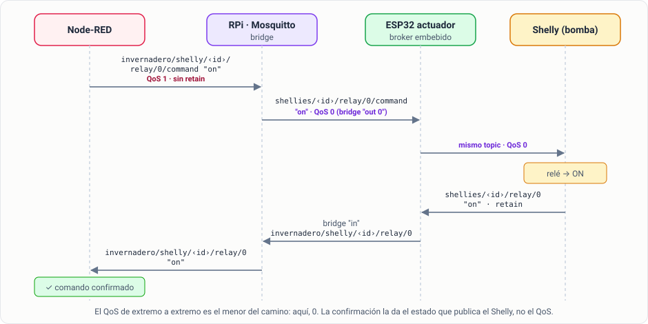

# Sesión 3 · MQTT e IoT en la red del invernadero

## Objetivos de la sesión

- Recibir todos los sensores del invernadero con una única suscripción con comodines.
- Normalizar los payloads al modelo de datos común del sistema y descartar las lecturas no válidas.
- Detectar los sensores que dejan de publicar y los ESP32 inalcanzables, y distinguir un caso del otro.
- Enviar comandos a los Shelly y comprobar que se han ejecutado.
- Justificar el QoS y el *retain* de datos, estados y comandos, y anunciar el estado de tu propio Node-RED con *birth* y *will*.

## Conexión con el sistema del invernadero

Hasta ahora el sistema escuchaba uno o dos topics sueltos. En esta sesión construyes la **capa de comunicaciones** completa:

- Todas las magnitudes del invernadero entran por un único punto, con el mismo formato.
- El sistema sabe qué fuentes fallan.
- Actúa por primera vez sobre el mundo real, a través de la bomba y el ventilador.

Lo que dejas en el contexto global lo usarán las sesiones siguientes. El panel de la sesión 4 leerá `sensores` y `actuadores`, la base de datos de la sesión 5 guardará los datos normalizados y las alarmas de la sesión 6 saldrán de `problemas`.

## Conceptos clave

La teoría de MQTT ya la conoces de la práctica anterior: publicación y suscripción, topics, comodines, QoS, *retain* y LWT. Aquí solo repasamos lo que cambia al llevarla a un sistema con muchas fuentes.

### Los topics del broker central

La Raspberry Pi reúne los brokers de los siete ESP32 y publica sus datos bajo una jerarquía común. Además, **genera** un topic `online` por cada ESP32 que indica si lo alcanza.


Los payloads son **números en texto plano** (`"23.4"`), tal como los publican los ESP32. La referencia completa de topics está en `rpi/README.md` del repositorio.

### *Retain*: último valor conocido, no valor actual

Los ESP32 publican sus lecturas con *retain*. Al suscribirte recibes al instante la última lectura de cada topic, aunque sea de hace una hora o de un sensor que ya no funciona. En Node-RED lo sabes por `msg.retain`: vale `true` en los mensajes retenidos que entrega el broker al suscribirte.

### QoS y *retain* según el tipo de mensaje

| Tipo de mensaje | Ejemplo | QoS | *Retain* |
|-----------------|---------|-----|----------|
| Lectura periódica | `invernadero/dht22/temperatura` | 0: si se pierde una, llega otra en 5 s | Sí: el último valor conocido es útil |
| Estado | `invernadero/shelly/<id>/relay/0`, `…/online` | 1 | Sí: quien se conecta debe conocer el estado |
| Comando | `invernadero/shelly/<id>/relay/0/command` | 1 | **Nunca** |

Un comando retenido se volvería a ejecutar cada vez que el Shelly se reconectara al broker: una bomba que se enciende sola tras un corte de red.



El QoS se negocia **en cada tramo**: el bridge de la RPi reenvía con QoS 0, así que de extremo a extremo el comando viaja con QoS 0 aunque Node-RED lo publique con QoS 1. Por eso no basta con el QoS: la única prueba de que el comando se ha ejecutado es el **estado que publica el Shelly**.

### El modelo de datos común

Cada lectura, venga del sensor que venga, se convierte en:

```json
{
  "sensor": "suelo",
  "magnitud": "humedad",
  "valor": 42.5,
  "unidad": "%",
  "ts": 1790334799957,
  "retenido": false
}
```

Así el panel, la base de datos y las alarmas trabajan con un único formato, y añadir un sensor nuevo no obliga a tocarlos.

## Práctica guiada paso a paso

### Paso 0 · Actualizar el entorno (5 min)

Descarga la nueva versión de `docker/` y añade a tu `.env` los IDs de los Shelly:

::: code-group

```ini [.env · laboratorio]
# IDs reales: te los da el profesorado
SHELLY_BOMBA=shellyplug-s-XXXXXXXXXXXX
SHELLY_VENTILADOR=shellyplug-s-XXXXXXXXXXXX
```

```ini [.env · casa (simulador)]
SHELLY_BOMBA=shellyplug-s-SIM001
SHELLY_VENTILADOR=shellyplug-s-SIM002
```

:::

Aplica los cambios con `docker compose up -d`.

### Paso 1 · Explorar el árbol (10 min)

En una pestaña nueva, un `mqtt in` con el topic `invernadero/#` conectado a un `debug`. Despliega y observa durante un minuto:

- ¿Cuántos topics distintos aparecen? Compáralos con el árbol de arriba.
- ¿Qué IDs tienen los Shelly? Búscalos en los topics `invernadero/shelly/…`.
- ¿Qué llega nada más desplegar, antes de que ningún sensor publique? Son los mensajes retenidos.

Después **desactiva el `debug`** (botón de su derecha) o borra el nodo: `#` recibe todo y llena la depuración.

::: tip Con otras herramientas
MQTT Explorer o `mosquitto_sub -v -t 'invernadero/#'`, que ya usaste, muestran lo mismo. Usa el usuario `alumno`.
:::

### Paso 2 · Una suscripción para todos los sensores (15 min)

Sustituye el topic por `invernadero/+/+`. Antes de desplegar, predice cuáles de estos topics recibirás:

| Topic | ¿Coincide con `invernadero/+/+`? |
|-------|:------:|
| `invernadero/dht22/temperatura` | ? |
| `invernadero/tds/online` | ? |
| `invernadero/shelly/<id>/relay/0` | ? |
| `invernadero/shelly/command` | ? |

Despliega y comprueba tu predicción. `+` sustituye **exactamente un nivel**: `invernadero/+/+` recoge los topics de tres niveles (magnitudes y `online`), pero no los de los Shelly, que tienen más.

### Paso 3 · Normalizar (30 min)

Conecta el `mqtt in` a un `function` llamado `normalizar` con **3 salidas** (pestaña *Setup* → *Outputs*):

```js
// invernadero/<nodo>/<magnitud>  ->  modelo de datos común
// Salidas: 1 datos · 2 estado del puente (online) · 3 descartados
const UNIDADES = { temperatura: "ºC", humedad: "%", distancia: "cm", peso: "g", lectura: "ADC", tds: "ppm", voltaje: "V" };
// Límites físicos de cada magnitud: fuera de ellos la lectura es un error del sensor
const RANGOS = { temperatura: [-20, 60], humedad: [0, 100], distancia: [2, 450], peso: [-100, 20000], lectura: [0, 4095], tds: [0, 2000], voltaje: [0, 3.3] };

const [, sensor, magnitud] = msg.topic.split("/");
const texto = String(msg.payload).trim();

if (magnitud === "online") {
    msg.tipo = "online";
    msg.payload = { sensor, valor: Number(texto) };
    return [null, msg, null];
}

const valor = Number(texto);
const rango = RANGOS[magnitud];
if (!rango || texto === "" || !Number.isFinite(valor) || valor < rango[0] || valor > rango[1]) {
    msg.payload = { topic: msg.topic, recibido: texto, motivo: rango ? "valor no válido" : "magnitud desconocida" };
    return [null, null, msg];
}

msg.tipo = "dato";
msg.payload = {
    sensor,
    magnitud,
    valor,
    unidad: UNIDADES[magnitud],
    ts: Date.now(),                 // hora de recepción, no de medida
    retenido: msg.retain === true   // true: último valor conocido, entregado al suscribirse
};
return [msg, null, null];
```

- Una función con varias salidas devuelve un **array**: cada posición va a una salida, y `null` significa "nada por esa salida".
- `msg.topic` no se toca: el watchdog del paso 5 lo necesita.
- `msg.tipo` marca de qué clase es cada mensaje; lo usarás en el paso 6.

Conecta un `debug` a cada salida. **Prueba:** un `inject` con topic `invernadero/dht22/humedad` y payload *string* `130` debe salir por la tercera salida con el motivo `valor no válido`.

### Paso 4 · Guardar el último valor (10 min)

Un `function` llamado `guardar último valor`, conectado a la salida 1:

```js
// Último valor de cada magnitud, accesible desde cualquier pestaña
const p = msg.payload;
const sensores = global.get("sensores") || {};
sensores[p.sensor] = sensores[p.sensor] || {};
sensores[p.sensor][p.magnitud] = { valor: p.valor, unidad: p.unidad, ts: p.ts };
global.set("sensores", sensores);
return null;
```

En **Context Data → Global**, `sensores` debe mostrar todos los nodos del invernadero con sus magnitudes. Es el "estado actual" que leerá el panel de la sesión 4.

### Paso 5 · Watchdog: detectar el silencio (25 min)

Si un sensor falla, el ESP32 **deja de publicar**: no manda ningún aviso. Hay que detectar la **ausencia** de mensajes. Todos los ESP32 publican como mínimo cada 5 segundos, así que 30 segundos sin datos de un topic indican un problema.

1. Conecta la salida 1 de `normalizar` a un nodo `trigger` llamado `watchdog 30 s`:

   | Campo | Valor |
   |-------|-------|
   | Send | *nothing* |
   | then | *wait for* **30 seconds** |
   | | ✔ *extend delay if new message arrives* |
   | then send | *string* `sin datos` |
   | Handling | *each* `msg.topic` *independently* |

2. Detrás, un `change` que asigne `msg.tipo` = `silencio`.


Con *extend delay*, cada mensaje nuevo reinicia la cuenta atrás. Solo si pasan 30 segundos sin mensajes de ese topic, el `trigger` emite `sin datos`. *Each msg.topic independently* mantiene una cuenta atrás **por topic** con un solo nodo.

### Paso 6 · Silencio frente a inalcanzable (30 min)

Hay dos formas distintas de fallar, y el sistema debe distinguirlas:

| Situación | Cómo se detecta | Qué suele significar |
|-----------|-----------------|----------------------|
| El ESP32 está conectado, pero un topic deja de publicar | Watchdog: `sin datos` | Sensor averiado o desconectado del ESP32 |
| La RPi no alcanza el ESP32 | `invernadero/<nodo>/online` = `0` | ESP32 apagado o fuera de la Wi-Fi |

Un `function` llamado `estado de sensores` recibe las tres fuentes: la salida 1 de `normalizar` (datos), la salida 2 (online) y el `change` del watchdog (silencio).

```js
// Mantiene la lista de fuentes con problemas y emite solo los cambios
const problemas = global.get("problemas") || {};
const ahora = Date.now();
let evento = null;

if (msg.tipo === "silencio") {
    // El trigger avisa: este topic lleva demasiado tiempo sin publicar
    if (!problemas[msg.topic]) {
        problemas[msg.topic] = { motivo: "sin datos", desde: ahora };
        evento = { fuente: msg.topic, estado: "sin datos" };
    }
} else if (msg.tipo === "online") {
    // La RPi informa de si alcanza el ESP32
    const clave = `invernadero/${msg.payload.sensor}`;
    if (msg.payload.valor === 0 && !problemas[clave]) {
        problemas[clave] = { motivo: "ESP32 inalcanzable", desde: ahora };
        evento = { fuente: clave, estado: "inalcanzable" };
    } else if (msg.payload.valor === 1 && problemas[clave]) {
        delete problemas[clave];
        evento = { fuente: clave, estado: "alcanzable" };
    }
} else if (msg.tipo === "dato" && problemas[msg.topic]) {
    // Vuelven a llegar datos de un topic que estaba en silencio
    delete problemas[msg.topic];
    evento = { fuente: msg.topic, estado: "recuperado" };
}

global.set("problemas", problemas);
const n = Object.keys(problemas).length;
node.status({ fill: n ? "red" : "green", shape: "dot", text: n ? `${n} con problemas` : "todo OK" });

if (!evento) return null;
msg.payload = { ...evento, ts: new Date(ahora).toISOString() };
return msg;
```

La función **solo emite cuando algo cambia**: una fuente empieza a fallar o se recupera. Con cada lectura normal no sale nada. En la sesión 6, estos eventos serán las alarmas que lleguen a Telegram.

**Pruebas.** En casa, provoca los fallos con el simulador:

```bash
# El sensor de suelo deja de publicar (el ESP32 sigue "alcanzable")
docker compose exec mosquitto mosquitto_pub -u alumno -P alumno -t simulador/fallo/suelo -m sensor
# El ESP32 del TDS desaparece de la red
docker compose exec mosquitto mosquitto_pub -u alumno -P alumno -t simulador/fallo/tds -m desconectado
# Todo vuelve a la normalidad
docker compose exec mosquitto mosquitto_pub -u alumno -P alumno -t simulador/fallo/suelo -m ok
docker compose exec mosquitto mosquitto_pub -u alumno -P alumno -t simulador/fallo/tds -m ok
```

Debes ver `sin datos` unos 30 segundos después del primer comando, `inalcanzable` al instante con el segundo, y `recuperado` y `alcanzable` al restaurarlos. Fíjate en que el ESP32 inalcanzable **también** produce `sin datos` en sus topics 30 segundos después: un solo fallo genera varios eventos. En la sesión 6 agruparás las alarmas para avisar solo de la causa. En el laboratorio, el profesorado desconectará un sensor durante la sesión.

### Paso 7 · Enviar comandos a los Shelly (25 min)

1. Cuatro `inject`, `bomba ON`, `bomba OFF`, `ventilador ON` y `ventilador OFF`, con `msg.payload` = `on`/`off` (*string*) y una propiedad `msg.equipo` = `bomba`/`ventilador`.
2. Un `function` llamado `a topic de comando`:

   ```js
   // Traduce { equipo, payload } al topic de comando de su Shelly
   const ids = { bomba: env.get("SHELLY_BOMBA"), ventilador: env.get("SHELLY_VENTILADOR") };
   const id = ids[msg.equipo];
   if (!id) {
       node.warn(`No hay Shelly configurado para "${msg.equipo}"`);
       return null;
   }
   if (!["on", "off", "toggle"].includes(msg.payload)) {
       node.warn(`Orden no válida: ${msg.payload}`);
       return null;
   }
   msg.topic = `invernadero/shelly/${id}/relay/0/command`;
   msg.qos = 1;
   msg.retain = false;   // un comando nunca se retiene
   return msg;
   ```

3. Un `mqtt out` con el broker `Broker invernadero` y **Topic, QoS y Retain vacíos**: así los toma de `msg.topic`, `msg.qos` y `msg.retain`.

La función es la única que sabe qué Shelly es cada equipo y qué órdenes son válidas. El resto del sistema solo dice "bomba on". Ponle delante un `link in` llamado `comandos a actuadores`: será la entrada de comandos desde otras pestañas (el panel de la sesión 4 y el riego automático).

::: danger En el laboratorio, los Shelly son compartidos
Controlan la bomba y el ventilador reales del invernadero y todos los alumnos están conectados al mismo broker. **Envía comandos solo cuando el profesorado lo indique**, por turnos. En casa, con el simulador, puedes probar libremente.
:::

### Paso 8 · Confirmar el estado (15 min)

Enviar el comando no garantiza que se ejecute. Suscríbete al estado real:

1. `mqtt in` con el topic `invernadero/shelly/+/relay/0` → `function` `estado actuadores`:

   ```js
   // invernadero/shelly/<id>/relay/0  ->  estado confirmado de cada equipo
   const id = msg.topic.split("/")[2];
   const equipos = { [env.get("SHELLY_BOMBA")]: "bomba", [env.get("SHELLY_VENTILADOR")]: "ventilador" };
   const equipo = equipos[id] || id;

   const actuadores = global.get("actuadores") || {};
   actuadores[equipo] = { estado: msg.payload, id, ts: Date.now() };
   global.set("actuadores", actuadores);

   node.status({ fill: msg.payload === "on" ? "blue" : "grey", shape: "dot", text: `${equipo}: ${msg.payload}` });
   msg.payload = { equipo, estado: msg.payload };
   return msg;
   ```

2. Un `inject` con topic `invernadero/shelly/command` y payload `update`, conectado al `mqtt out`. Pide a los Shelly que publiquen su estado completo.

Pulsa `bomba ON` y observa el recorrido del diagrama de [QoS y retain](#qos-y-retain-segun-el-tipo-de-mensaje): el estado de `estado actuadores` debe cambiar a `bomba: on` en uno o dos segundos.

### Paso 9 · Tu Node-RED también se anuncia: *birth* y *will* (10 min)

Los Shelly publican `online` para que se sepa si están conectados. Haz lo mismo con tu Node-RED:

1. Abre el nodo de configuración `Broker invernadero` → pestaña **Messages**.
2. **Birth message**: topic `alumnos/<tu-nombre>/nodered`, payload `online`, QoS 1, *retain*.
3. **Close message**: el mismo topic, payload `offline`, *retain*.
4. **Will message**: el mismo topic, payload `offline`, QoS 1, *retain*.
5. Despliega y comprueba desde una terminal:

   ```bash
   mosquitto_sub -h <broker> -u alumno -P <contraseña> -v -t 'alumnos/+/nodered'
   ```

6. Prueba las dos formas de parar:
   - `docker compose stop node-red` cierra la conexión limpiamente y el broker publica el *close message*.
   - `docker compose kill node-red` corta en seco. Node-RED no llega a despedirse y es el **broker** quien publica el *will*, cuando detecta la desconexión.

   Vuelve a arrancarlo con `docker compose up -d`.

Flujo de referencia de la práctica guiada: [s3-integracion-mqtt.json](../flows/s3-integracion-mqtt.json){download}. No incluye el *birth*/*will*, que es personal: configúralo tú.

## Node-RED como plataforma

### Nodos de configuración

`Broker invernadero` no es un nodo del flujo: es un **nodo de configuración** que comparten todos los `mqtt in` y `mqtt out`.

- Lo ves en la barra lateral **Configuration nodes** (menú ☰ → *Configuration nodes*), que también marca los que no usa ningún nodo.
- Node-RED abre **una sola conexión** por nodo de configuración, no una por cada `mqtt in`. Cambiar el host o el *birth* en un sitio afecta a todos los nodos que lo usan.
- Por eso el Client ID debe ser único **por Node-RED**. Dos Node-RED con el mismo ID se expulsan del broker el uno al otro en bucle. Dejarlo vacío genera uno aleatorio.

### Subflujos

Un subflujo empaqueta varios nodos en uno reutilizable, con **propiedades** configurables en cada instancia.

**Ejercicio:** convierte el watchdog en un subflujo `vigilante` con un tiempo configurable.

1. Selecciona el `trigger` y el `change` del watchdog → menú ☰ → *Subflows* → *Selection to Subflow*.
2. Edita el subflujo (doble clic en su plantilla, en la paleta) → *Edit properties* → añade la propiedad `TIMEOUT_S`, tipo número, valor por defecto `30`.
3. Dentro del subflujo, antes del `trigger`, añade un `change` que asigne `msg.delay` a la expresión JSONata `$number($env("TIMEOUT_S")) * 1000`. En el `trigger`, marca *Override delay with msg.delay*.
4. Usa dos instancias: una de 30 s para los sensores y otra de 90 s para un topic que publique más despacio.

## Entregable y evidencias para el informe

### Qué debe funcionar

1. **Todos los sensores integrados.** `global.sensores` contiene todas las magnitudes del invernadero en el modelo común. Las lecturas no válidas se descartan y se ven en la depuración.
2. **Vigilancia.** Se detectan tanto el silencio de un topic (30 s) como un ESP32 inalcanzable, con su evento de recuperación. `global.problemas` refleja el estado actual.
3. **Riego automático con confirmación.**
   - Conecta la decisión de riego de tu flujo de la sesión 1 a la bomba con `link out`/`link in`: `on` cuando haya que regar, `off` cuando no.
   - Envía el comando **solo cuando la decisión cambie** (usa el campo `cambio` de la sesión 1), no con cada lectura.
   - Si 10 segundos después de un comando el estado del Shelly no coincide, emite el evento `comando sin confirmar`.
4. **API ampliada.** `GET /api/invernadero/estado` (sesión 2) devuelve también `sensores`, `problemas` y `actuadores`.

**Reto opcional: enclavamiento de seguridad.** La bomba no debe encenderse si el depósito está casi vacío (distancia ≥ 35 cm) **ni si el sensor de distancia está en `problemas`**. Si no sabes cuánta agua hay, no bombeas. Esto se llama diseño *fail-safe*: ante la duda, el estado seguro.

::: warning Prueba del riego automático en el laboratorio
Hazla por turnos y con el profesorado presente: la bomba es real y compartida. Antes, pruébalo todo en casa con el simulador.
:::

### Cómo se comprueba

- `global.sensores` tiene todos los nodos y magnitudes y se actualiza en tiempo real.
- Con los fallos del simulador (o el sensor que desconecte el profesorado) aparecen los eventos `sin datos`, `inalcanzable`, `recuperado` y `alcanzable`, uno por cambio.
- Al cambiar la decisión de riego, la bomba cambia de estado y se confirma. Si apagas el Shelly o provocas `simulador/fallo/actuador desconectado`, aparece `comando sin confirmar`.

**Criterios de calidad:**
- Los comandos nunca se publican con *retain*.
- Hay un solo punto que traduce equipo → Shelly.
- No se envían comandos repetidos.
- Nodos con nombre y flujo organizado en grupos.

### Evidencias que debes guardar

- [ ] Captura del flujo completo.
- [ ] Captura de **Context Data → Global** con `sensores`, `problemas` y `actuadores`.
- [ ] Captura de la depuración con la secuencia de eventos de las pruebas de fallo.
- [ ] Captura de `mosquitto_sub` (o MQTT Explorer) mostrando tu `alumnos/<tu-nombre>/nodered` en `online` y en `offline`.
- [ ] Flujo exportado: `s3-<tu-apellido>.json`.
- [ ] En el informe, respuesta breve a:
  - ¿Por qué un comando nunca debe publicarse con *retain*? Describe qué pasaría en el invernadero.
  - ¿Con qué QoS llega tu comando al Shelly? ¿Qué te garantiza entonces que se ha ejecutado?
  - ¿Qué diferencia hay entre `sin datos` e `inalcanzable`, y por qué hacen falta dos mecanismos para detectarlos?
  - ¿Cuándo publica el broker tu *will* y cuándo tu *close message*?

## Recursos adicionales

- [Node-RED Cookbook — MQTT](https://cookbook.nodered.org/mqtt/)
- [Node-RED — Configuration nodes](https://nodered.org/docs/user-guide/editor/sidebar/config)
- [Node-RED — Subflows](https://nodered.org/docs/user-guide/editor/workspace/subflows)
- [HiveMQ — Quality of Service levels](https://www.hivemq.com/blog/mqtt-essentials-part-6-mqtt-quality-of-service-levels/)
- [HiveMQ — Retained messages](https://www.hivemq.com/blog/mqtt-essentials-part-8-retained-messages/)
- [Shelly Gen1 — API MQTT](https://shelly-api-docs.shelly.cloud/gen1/#shelly-plug-plugs-mqtt)
- [Mosquitto — mosquitto.conf (bridges)](https://mosquitto.org/man/mosquitto-conf-5.html)
