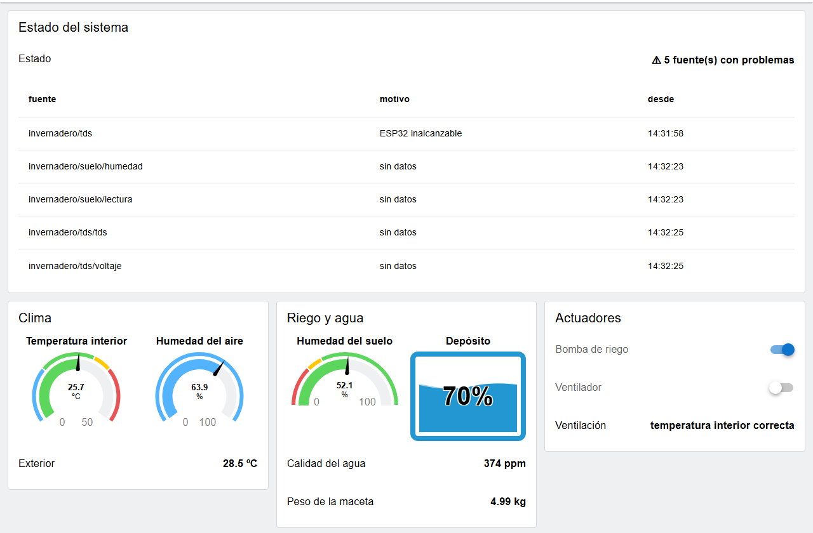

# Sesión 4 · Paneles de monitorización

## Objetivos de la sesión

- Construir un panel de operador con **Dashboard 2.0**: páginas, grupos, gauges, textos, tablas y gráficas.
- Aplicar criterios de diseño HMI: estado general arriba, agrupación por proceso, color solo para lo anómalo y unidades siempre visibles.
- Controlar la bomba y el ventilador desde el panel mostrando su estado **confirmado**, no el clic.
- Hacer editables los umbrales de control desde el panel, con validación.
- Distinguir en el panel un valor actual de uno congelado por un sensor averiado.

## Conexión con el sistema del invernadero

Hasta ahora el estado del invernadero solo se veía en la barra de depuración y en `Context Data`. En esta sesión construyes la **interfaz del operador**: una página web que cualquiera puede abrir desde el móvil o el PC del laboratorio para saber cómo está el invernadero y actuar sobre él.

El panel **no recibe datos por su cuenta**. Lee el contexto global que llenan las sesiones anteriores (`sensores`, `actuadores` y `problemas` de la S3, `meteo` y `ventilacion` de la S2) y envía los comandos al punto único de la S3. Así se muestra lo mismo que usan la lógica de control y las alarmas, sin repetir código.

Este es el panel que construirás, funcionando con el simulador:


## Conceptos clave

### Dashboard 2.0

Dashboard 2.0 (`@flowfuse/node-red-dashboard`) añade a la paleta nodos que se convierten en elementos de una página web servida por el mismo Node-RED. Ya viene instalado en la imagen del curso. Su estructura tiene tres niveles de configuración, y los widgets cuelgan del último:


| Nodo | Qué es | Dónde se ve |
|------|--------|-------------|
| `ui-base` | La aplicación del panel. Define la ruta base (`/dashboard`) | Nodo de configuración |
| `ui-page` | Una página: ruta, disposición (*grid*, *fixed*, *notebook*) y tema | Nodo de configuración; aparece en el menú lateral del panel |
| `ui-group` | Una tarjeta dentro de la página, con un ancho en columnas (de 12) | Nodo de configuración |
| `ui-theme` | Colores y espaciados | Nodo de configuración |
| Widgets (`ui-gauge`, `ui-text`, `ui-switch`, `ui-chart`…) | Lo que ve el operador | Nodos del flujo, cada uno asignado a un grupo |

Documentación: [Dashboard 2.0](https://dashboard.flowfuse.com/).

### Principios de una HMI industrial

Un panel de operador no es una web vistosa: su trabajo es que el operador detecte **en segundos** si algo va mal. Algunas reglas, inspiradas en la norma ISA-101 (*High Performance HMI*):

| Principio | En el panel del invernadero |
|-----------|------------------------------|
| Lo más importante, arriba | El grupo **Estado del sistema** ocupa todo el ancho y dice "Todo en orden" o cuántas fuentes fallan |
| Agrupar por proceso, no por tipo de widget | Clima, Riego y agua, Actuadores: no "todos los gauges" juntos |
| Fondo neutro, color solo para lo anómalo | Página gris claro; verde, ámbar y rojo solo en los rangos de los gauges |
| Unidades siempre visibles | `ºC`, `%`, `ppm`, `kg` en cada valor |
| Mostrar el estado real | El interruptor refleja lo que dice el Shelly, no lo que se pulsó |
| No mentir con datos viejos | Un valor congelado por un sensor averiado debe distinguirse de uno actual |

### Leer del contexto frente a recibir mensajes

Hay dos formas de alimentar un widget: conectarlo al cable por el que llegan los datos (eventos) o leer el contexto global cada cierto tiempo (muestreo). Aquí se usa el **muestreo cada 2 segundos, enviando solo lo que cambia**:

- El panel queda desacoplado de las otras pestañas: depende de los nombres del contexto global, no de cómo están hechos los flujos de las sesiones 2 y 3.
- Un navegador que se conecta tarde recibe enseguida el estado actual.
- Enviar solo lo que cambia evita saturar la conexión con el navegador.

Las gráficas son la excepción: toman una muestra cada 10 s aunque el valor no cambie, para que el eje de tiempo sea regular.

## Práctica guiada paso a paso

### Paso 0 · Preparar la sesión 3 para el panel (5 min)

El panel envía los comandos al **punto único** de la sesión 3, a través de un `link in`. Si importaste el flujo de referencia de la S3, ya lo tienes: se llama `comandos a actuadores` y está conectado a `a topic de comando`. Si hiciste tu propio flujo, añade ese `link in` delante de tu función de comandos.

### Paso 1 · Primer widget (20 min)

1. En una pestaña nueva, un `inject` con payload número `42` → un `ui-gauge`.
2. En el gauge, pulsa el lápiz de **Group** y crea la cadena de configuración:
   - un **ui-group** `Clima`, de ancho 4, con una nueva **ui-page**;
   - la **ui-page** `Invernadero`, con ruta `/invernadero`, disposición *Grid* y una nueva **ui-base** (deja la ruta `/dashboard`).
3. Despliega, abre [http://localhost:1880/dashboard/invernadero](http://localhost:1880/dashboard/invernadero) y pulsa el `inject`: la aguja marca 42.
4. Abre la página también en el móvil (`http://<IP de tu PC>:1880/dashboard/invernadero`, en la misma red). Todos los navegadores ven el mismo estado.

::: tip ¿Dónde está la página?
El menú ☰ de la barra superior del panel lista las páginas. En el editor, la barra lateral **Dashboard 2.0** (icono de rejilla) muestra la estructura de páginas y grupos y permite reordenarlos.
:::

### Paso 2 · Estructura del panel (15 min)

Crea los grupos antes que los widgets. Siguen los principios HMI: el estado general arriba y el resto agrupado por proceso.

| Grupo | Ancho | Contenido |
|-------|:-----:|-----------|
| Estado del sistema | 12 | Resumen y tabla de problemas |
| Clima | 4 | Temperatura interior, humedad del aire, temperatura exterior |
| Riego y agua | 4 | Humedad del suelo, depósito, calidad del agua, peso |
| Actuadores | 4 | Bomba, ventilador, motivo de la ventilación |
| Tendencias (última hora) | 12 | Gráficas |
| Consignas | 6 | Umbrales editables |

El orden de los grupos en la página se ajusta en la barra lateral **Dashboard 2.0**.

### Paso 3 · Clima: del contexto global a los widgets (30 min)

1. Un `inject` que se repita **cada 2 segundos** (y *once* al desplegar).
2. Un `function` llamado `grupo Clima` con **3 salidas**:

   ```js
   // Contexto global -> widgets del grupo Clima (solo lo que cambia)
   const ultimo = context.get("ultimo") || {};
   const si_cambia = (clave, valor) => {
       if (valor === undefined || valor === null) return null;
       const huella = JSON.stringify(valor);
       if (huella === ultimo[clave]) return null;
       ultimo[clave] = huella;
       return { payload: valor };
   };
   const s = global.get("sensores") || {};
   const meteo = global.get("meteo");
   const salidas = [
       si_cambia("temp", s.dht22?.temperatura?.valor),
       si_cambia("hum", s.dht22?.humedad?.valor),
       si_cambia("ext", meteo ? `${meteo.tempExterior} ºC` : "sin datos")
   ];
   context.set("ultimo", ultimo);
   return salidas;
   ```

   - `?.` (*optional chaining*) devuelve `undefined` en vez de fallar si todavía no ha llegado ningún dato de ese sensor.
   - `si_cambia` recuerda, en el contexto **del nodo**, lo último que envió por cada salida.

3. Conecta las salidas a dos `ui-gauge` (tipo **3/4**) y un `ui-text`:

   | Widget | Rango | Unidades | Segmentos (color desde) |
   |--------|-------|----------|--------------------------|
   | Temperatura interior | 0–50 | ºC | azul 0 · verde 15 · ámbar 30 · rojo 35 |
   | Humedad del aire | 0–100 | % | un solo color neutro |
   | Exterior (`ui-text`) | | | |

   La humedad del aire no tiene un rango "malo" definido en el sistema, así que no lleva colores de estado: el color se reserva para lo que exige atención.

### Paso 4 · Riego y agua: el depósito en % (20 min)

El sensor de ultrasonidos mide la **distancia** hasta el agua, pero al operador le interesa el **nivel**. La conversión depende del depósito:

1. Un `inject` *once* que guarde en `flow.deposito` las distancias con el depósito lleno y vacío:

   ```json
   { "llenoCm": 5, "vacioCm": 40 }
   ```

   Son los valores del simulador. En el laboratorio, mide el depósito real.

2. Un `function` llamado `grupo Riego y agua` con 4 salidas. Usa la misma función `si_cambia` del paso 3 y calcula el nivel así:

   ```js
   const dep = flow.get("deposito");
   const d = s.ultrasonidos?.distancia?.valor;
   let nivel;
   if (d !== undefined && dep) {
       nivel = (dep.vacioCm - d) / (dep.vacioCm - dep.llenoCm) * 100;
       nivel = Math.round(Math.min(100, Math.max(0, nivel)));
   }
   ```

3. Widgets:
   - `ui-gauge` **semicircular** para la humedad del suelo, con segmentos rojo 0 · ámbar 25 · verde 35, los umbrales de la sesión 1;
   - `ui-gauge` de tipo **tank** para el depósito;
   - dos `ui-text` para la calidad del agua (`368 ppm`) y el peso (`4.83 kg`).

### Paso 5 · Actuadores: mostrar el estado confirmado (25 min)

1. Dos `ui-switch`, `Bomba de riego` y `Ventilador`:

   | Campo | Valor |
   |-------|-------|
   | On payload / Off payload | *string* `on` / `off` |
   | Topic | *string* `bomba` (o `ventilador`) |
   | Pass through | desmarcado |
   | Indicator | **Switch icon shows state of the input** |

2. Salida de los interruptores → `change` (`msg.equipo` = `msg.topic`) → `link out` hacia `comandos a actuadores` de la sesión 3.
3. Un `function` llamado `grupo Actuadores`, alimentado por el `inject` de 2 s, que envía a cada interruptor `global.actuadores.<equipo>.estado`.

Con *Switch icon shows state of the input* (`decouple`), el interruptor **no cambia al hacer clic**: cambia cuando llega el estado del Shelly.


Pruébalo en casa con `simulador/fallo/actuador` = `desconectado`: el clic envía el comando, pero el interruptor se queda en *off*, porque el Shelly no lo ha confirmado. Eso es exactamente lo que debe ver el operador.

::: danger En el laboratorio, los Shelly son compartidos
Si todos los alumnos tienen el panel abierto, cualquier clic enciende la bomba real. Usa los interruptores solo cuando el profesorado lo indique. En casa, con el simulador, prueba libremente.
:::

### Paso 6 · Tendencias (20 min)

1. Un `inject` cada **10 segundos** → `function` `muestrear tendencias` con 2 salidas:

   ```js
   // Muestreo para las gráficas: un punto cada 10 s por serie
   const s = global.get("sensores") || {};
   const meteo = global.get("meteo");
   const temp = [];
   if (s.dht22?.temperatura) temp.push({ topic: "interior", payload: s.dht22.temperatura.valor });
   if (meteo) temp.push({ topic: "exterior", payload: meteo.tempExterior });
   const suelo = s.suelo?.humedad ? { topic: "suelo", payload: s.suelo.humedad.valor } : null;
   // Un array en una salida envía varios mensajes seguidos
   return [temp, suelo];
   ```

2. Dos `ui-chart` de tipo **line**, con eje X de tiempo, *series* por `msg.topic` y *Action* `append`. Borra los puntos de más de 1 hora.

**Una gráfica por unidad.** La temperatura interior y la exterior comparten gráfica porque tienen la misma unidad. La humedad del suelo va en otra: mezclar ºC y % con dos ejes Y en la misma gráfica invita a comparar alturas que no son comparables. La serie `exterior` sale casi plana porque la previsión solo se actualiza cada 15 minutos. En la sesión 5 estas gráficas se alimentarán del histórico de la base de datos y no se perderán al recargar.

### Paso 7 · Estado del sistema (15 min)

Un `function` llamado `grupo Estado` (en el `inject` de 2 s) convierte `global.problemas` en un resumen y una lista de filas:

```js
const p = global.get("problemas") || {};
const filas = Object.entries(p).map(([fuente, info]) => ({
    fuente,
    motivo: info.motivo,
    desde: new Date(info.desde).toLocaleTimeString("es-ES")
}));
const resumen = filas.length ? `⚠ ${filas.length} fuente(s) con problemas` : "✓ Todo en orden";
```

Envía `resumen` a un `ui-text` de ancho 12 y `filas` a un `ui-table` con *Action* `replace`: cada mensaje sustituye la tabla completa.

Provoca un fallo con el simulador (`simulador/fallo/suelo` = `sensor`) y espera 30 s:



**Fíjate en el gauge de humedad del suelo:** sigue marcando 52,1 %, el último valor que llegó antes de que el sensor fallara. Un operador que solo mire el gauge creerá que todo va bien. Resolverlo es parte del entregable.

### Paso 8 · Consignas editables (30 min)

Los umbrales estaban en el contexto **de flujo** de las pestañas S1 y S2, y el panel está en otra pestaña. Para que el operador pueda cambiarlos, pasan al contexto **global**.

1. **Migra tus flujos:**
   - en la S1, el `change` que carga los umbrales escribe en `global.umbrales`;
   - las reglas del `switch` leen de *global.*;
   - `decidir riego` lee `global.get("umbrales")`;
   - en la S2, `decidir ventilación` también lee de `global`.

   Un único objeto de umbrales para todo el sistema:

   ```json
   {
     "suelo": { "critico": 25, "aviso": 35 },
     "temperatura": { "aviso": 30, "critico": 35 },
     "margenExterior": 2
   }
   ```

2. Tres `ui-slider`: `Suelo: umbral crítico (%)`, `Suelo: umbral de aviso (%)` y `Temperatura: aviso (ºC)`. Como *topic*, pon la ruta del umbral (`suelo.critico`, `suelo.aviso`, `temperatura.aviso`) y elige *Output* **only on release**, para no enviar un valor por cada píxel del arrastre.
3. Un `function` llamado `actualizar umbrales` con 2 salidas, que **valida** antes de guardar:

   ```js
   // msg.topic = ruta del umbral ("suelo.critico"), msg.payload = nuevo valor
   const u = global.get("umbrales");
   const [grupo, clave] = msg.topic.split(".");
   const nuevo = structuredClone(u);
   nuevo[grupo][clave] = Number(msg.payload);

   // Validación: el umbral crítico del suelo debe quedar por debajo del de aviso
   if (nuevo.suelo.critico >= nuevo.suelo.aviso) {
       // Rechazado: aviso al operador y los deslizadores vuelven a su valor
       return [{ payload: "Consigna rechazada: el umbral crítico debe ser menor que el de aviso" }, { payload: u }];
   }
   global.set("umbrales", nuevo);
   return [{ payload: `Consigna actualizada: ${msg.topic} = ${msg.payload}` }, { payload: nuevo }];
   ```

4. La salida 1 va a un `ui-notification`. La salida 2 va a un `function` llamado `sincronizar consignas`, que devuelve a los tres deslizadores los valores guardados. Así, tras un rechazo, el deslizador vuelve a su sitio. Ese mismo nodo carga los umbrales por defecto al desplegar si aún no existen.

**Prueba:** sube el umbral crítico por encima del de aviso. Debe aparecer la notificación de rechazo y el deslizador debe volver atrás.

::: warning Los umbrales se pierden al reiniciar
El contexto está en memoria. Si reinicias Node-RED, los umbrales vuelven a los valores por defecto. En la sesión 6 configurarás un almacenamiento persistente del contexto en `settings.js`.
:::

### Paso 9 · Tema (5 min)

Crea un `ui-theme` `HMI invernadero` y asígnalo a la página. Pon el fondo de página gris claro (`#eef0f2`) y los grupos en blanco. Las tarjetas se separan del fondo sin necesidad de colores.

Flujo de referencia de la práctica guiada: [s4-panel.json](../flows/s4-panel.json){download}. Necesita que estén importados los de las sesiones 2 y 3 (lee su contexto global y envía los comandos al `link in` de la S3).


## Node-RED como plataforma

### Dashboard 2.0 frente a Dashboard 1.0

Si buscas ejemplos en Internet, encontrarás muchos del dashboard antiguo. No se mezclan:

| | Dashboard 1.0 | Dashboard 2.0 |
|--|---------------|---------------|
| Paquete | `node-red-dashboard` | `@flowfuse/node-red-dashboard` |
| Nombres de nodos | `ui_gauge`, `ui_chart`… (guion bajo) | `ui-gauge`, `ui-chart`… (guion medio) |
| Tecnología | AngularJS (sin mantenimiento desde 2021) | Vue 3 + Vuetify |
| Estado | Obsoleto | Mantenido |
| Estructura | Tab → Group | Base → Page → Group |
| URL por defecto | `/ui` | `/dashboard` |

Un flujo con nodos `ui_…` no funciona en Dashboard 2.0. Existe una [guía de migración](https://dashboard.flowfuse.com/user/migration.html).

### Cómo se sirve el panel

- El panel lo sirve **el mismo Node-RED**, en el mismo puerto que el editor (1880), bajo `/dashboard`. No hay otro servidor.
- El navegador descarga una aplicación web y mantiene abierta una conexión **WebSocket** (socket.io) con Node-RED. Por ella llegan los valores y salen los clics.
- Por defecto, todos los navegadores comparten el mismo estado: lo que envías a un widget lo ven todos. Por eso un clic en un interruptor afecta a todos los que tienen el panel abierto.
- Cualquiera que llegue a `http://<tu-IP>:1880/dashboard` puede usar el panel. En la sesión 6 protegerás el editor, y el panel se protege aparte.

### Temas

Un `ui-theme` define los colores (primario, fondo de página, fondo y borde de grupo) y los espaciados. Cada página usa un tema, así que puedes tener, por ejemplo, un tema claro para el laboratorio y otro de alto contraste para una pantalla de planta.

## Entregable y evidencias para el informe

### Qué debe funcionar

1. **Panel completo** en `/dashboard/invernadero`, con los seis grupos del paso 2, alimentado por **tus** flujos de las sesiones 2 y 3.
2. **Actuadores con estado confirmado**: los interruptores envían al punto único de comandos y muestran el estado real del Shelly.
3. **Consignas** editables y validadas en `global.umbrales`, usadas por la decisión de riego (S1) y de ventilación (S2).
4. **Sin datos congelados:** si una magnitud está en `problemas`, su valor se distingue claramente en el panel. Por ejemplo:
   - el texto muestra `— sin datos` en lugar del último valor;
   - o el gauge se oculta y aparece un aviso;
   - o el widget cambia de aspecto enviándole `msg.class` con una clase CSS.

   Elige una opción y justifícala en el informe.

**Reto opcional (elige uno):**
- **Página de detalle:** una segunda `ui-page`, `Sensores`, con una `ui-table` de todas las magnitudes de `global.sensores` y la antigüedad de cada lectura en segundos.
- **Confirmar antes de actuar:** al pulsar un interruptor, un `ui-notification` en modo diálogo pide confirmación antes de enviar el comando.

### Cómo se comprueba

- El panel refleja en pocos segundos los cambios del simulador (o del invernadero real).
- Con `simulador/fallo/actuador` = `desconectado`, pulsar la bomba no cambia el interruptor.
- Una consigna inválida se rechaza con aviso, y una válida cambia el comportamiento de la decisión de riego.
- Con `simulador/fallo/suelo` = `sensor`, la humedad del suelo aparece como sin datos a los 30 s.

**Criterios de calidad:**
- Estado general arriba y grupos por proceso.
- Unidades en todos los valores.
- Color solo en los rangos de estado.
- Una gráfica por unidad.
- Ningún comando enviado sin pasar por el punto único de la S3.

### Evidencias que debes guardar

- [ ] Captura del panel completo funcionando.
- [ ] Captura del panel con un fallo provocado, donde se vea cómo distingues el dato sin actualizar.
- [ ] Captura del flujo del panel en el editor.
- [ ] Captura de la notificación de consigna rechazada.
- [ ] Flujo exportado: `s4-<tu-apellido>.json`.
- [ ] En el informe, respuesta breve a:
  - ¿Por qué el interruptor debe mostrar el estado del Shelly y no el del clic? Describe una situación en el invernadero en la que la diferencia importe.
  - ¿Qué principio HMI has aplicado en cada grupo? ¿Cuál te ha costado más respetar?
  - ¿Qué ventajas e inconvenientes tiene alimentar el panel leyendo el contexto global cada 2 s frente a conectarlo directamente a los mensajes MQTT?

## Recursos adicionales

- [Dashboard 2.0 — Documentación](https://dashboard.flowfuse.com/)
- [Dashboard 2.0 — ui-gauge](https://dashboard.flowfuse.com/nodes/widgets/ui-gauge.html)
- [Dashboard 2.0 — ui-chart](https://dashboard.flowfuse.com/nodes/widgets/ui-chart.html)
- [Dashboard 2.0 — ui-switch](https://dashboard.flowfuse.com/nodes/widgets/ui-switch.html)
- [Dashboard 2.0 — Guía de migración desde 1.0](https://dashboard.flowfuse.com/user/migration.html)
- [ISA-101 — Human Machine Interfaces (resumen de ISA)](https://www.isa.org/standards-and-publications/isa-standards/isa-101-standards)
